## **плагин AJAX FILTER**

### update v1.2
- обнаружена и исправлена ошибка игнорирования настройки в виджете при загрузке страницы
- js разнесен в отдельный скрипт
- осмысленные имена функций
- работа с датой в объектном стиле
- использование WP-функциий для отправки json-ответа на AJAX-запрос
- интеграция переменных в JS через wp_localize_script
- почищено хранилище от ненужностей (.gitignore)
- оптимизирован JS (повторные селекторы JQuery убраны через переменные)

### v1.1

- обеспечивает AJAX-фильтрацию записей по заголовку
- можно указывать дату, от которой начнут отображаться записи
- можно задавать число отображаемых постов
- число отображаемых постов можно задавать и в настройках виджета

### Установка

- в админку загрузить зип-архив ajax-filter-plugin.zip,  результат нажатия кнопки "Установить" будет такой:  
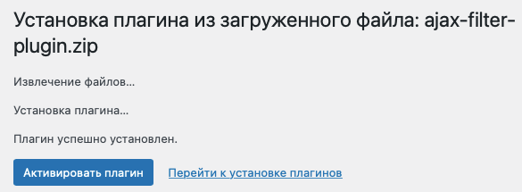

- после активации будет так:  
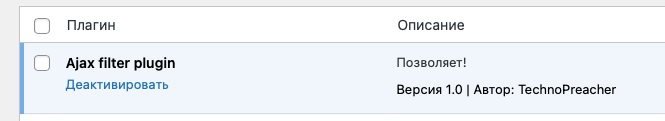

### Настройка виджета:  
Внешний вид -> Виджеты, добавляю в нужное место страницы и указываю число постов:  
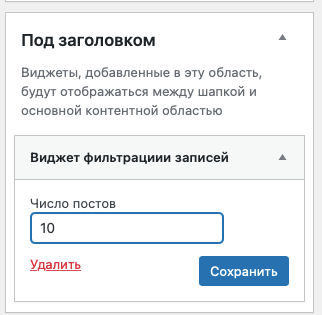

### Тестовые данные:
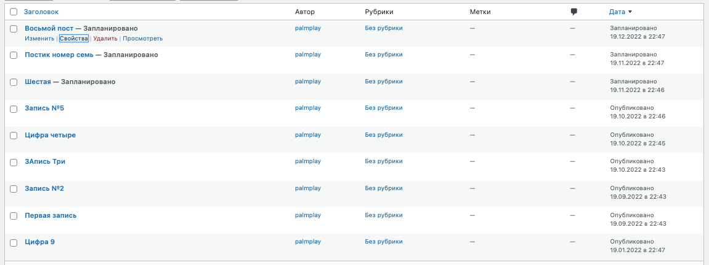

### Работа:
- при открытии страницы (после загрузки контента), сразу же происходит сработка фильтрации 
(об этом говорит пунктир вокруг записей);
- формируемые ссылки - кликабельны, и ведут на страницу с постом;
- фильтрация зависима (если заданно число записей, заголовок и дата, то выведутся только 
удовлетворяющие всем условиям записи);

Сам виджет выглядит так:  
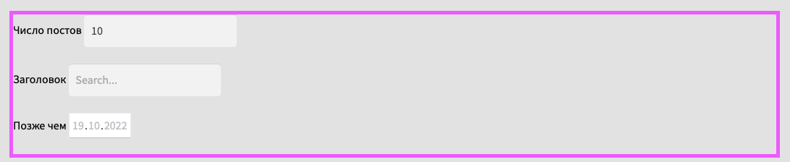

А фильтрованные записи вот так:  
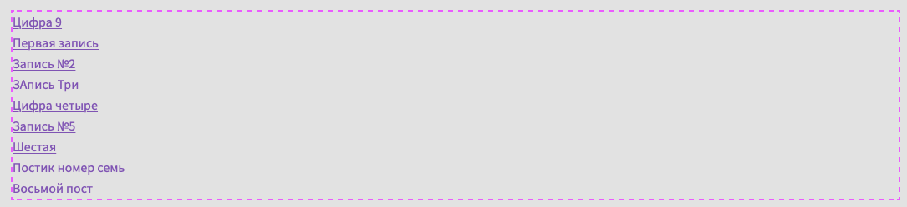

Если указать число постов, обновится аяксом:
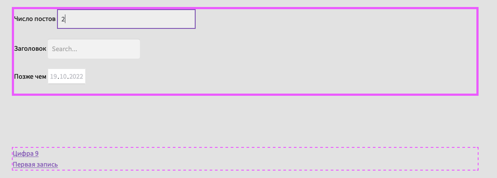  

Если задать заголовок, то пофильтрует по нему (при этом если не будет ограничения на число постов,
то выведет все подходящие):  
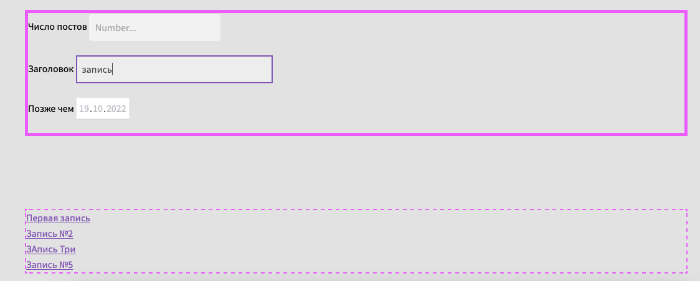

Ну а если задать дату - то будет сортировка по дате, и отображение от заданной и далее:
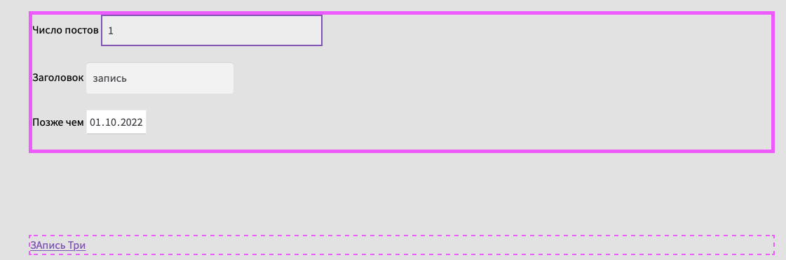

### Локализация:

- добавлен файл перевода, что видно, если перейти на Американский :-) 

так выглядит виджет:  
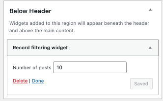

ну а так на фронте:  
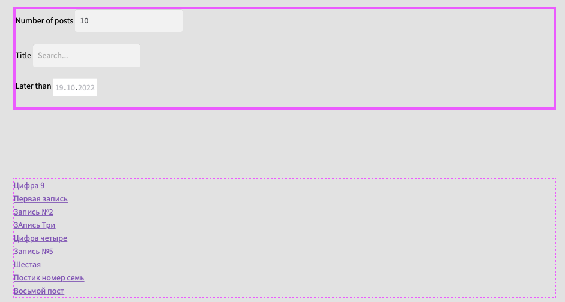

### Деактивация плагина:

Если его деактивировать, то результат будет таким (просто 5 последних постов):
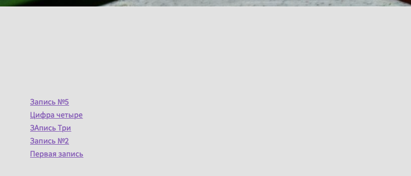

